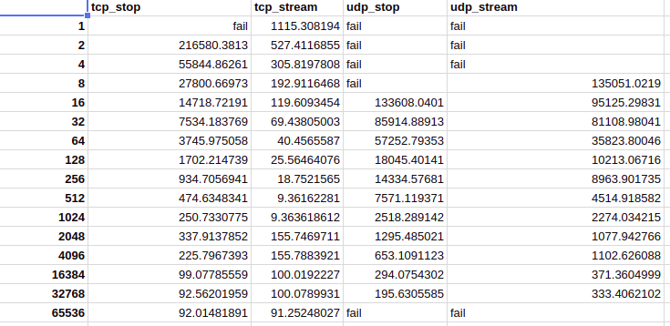
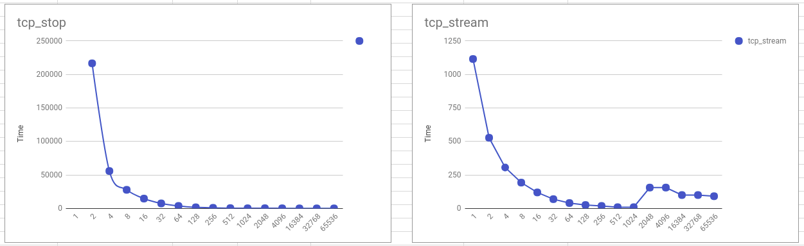
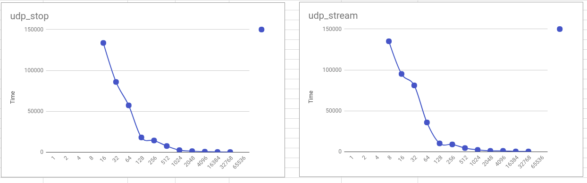

# Distributed Systems Homework 4

Alvin Chao 

The assignment is to determine the differences between TCP and UDP transport protocols, which will both use the stop and wait and pure streaming protocols to compare the differences between the two in speed when sending 1GB of data between the client and server.

## Instructions to run
This requires Python version 3.x to run and consists of two python files, server and client. Check your version:
```
$ python -V
Python 3.5.x or higher

```

Open two terminal windows: one the server machine and one on the client machine. Then change directory to the location of server.py for one terminal and client.py for the other. First start the server.

**Server terminal** 

There are 3 arguments that must be entered for server.py to run correctly.
```
$ python server.py [port_number] [transport_protocol] [acknowledgement_type]
```
+ **port_number**: an open port number
+ **transport_protocol**: `udp` or `tcp` 
+ **acknowledgement_type**: `stop`(for stop and wait) or `stream`(for streaming)


Also take note of the hostname.It can be found by typing `hostname` in terminal. you will need this name in the client terminal later, so copy it on a notepad. This will give you the name of the server
```
$ hostname
```
Here is an example server that will run the background.
```
$ python server.py 12345 tcp stop &
```
Notice the addition of the `&` that lets the program run in the background. Additional details are given in the server design section. 

**Client terminal**

Client will require 5 arguments that must be entered for client.py to run correctly.
```
$ python client.py [hostname] [port_number] [transport_protocol] [acknowledgment] [message_size]
```
+ **hostname** is the name of the system that is running server.py
+ **port_number**: an open port number
+ **transport_protocol**: `udp` or `tcp` 
+ **acknowledgment_type**: `stop`(for stop and wait) or `stream`(for streaming)
+ **message_size**: ranging from 1 byte to 65,536 bytes, incrementing in powers of two (1, 2, 4, 8, 16, …)

Then run the client file by typing this into terminal, let [hostname] be the host name of the machine that you wish to connect to
```
$ python client.py ls.cs.rutgers.edu 12345 tcp stop 1024
```

In pratice when running these on the ilab machines we had a scipt that would fire up a bunch of servers as background process like so: `python3 server.py 12345 tcp stop &`. Then many clients would spawn and connect to their respective servers and save their output to a file so we can have results saved for viewing later. We did this like so: `python3 client.py python.cs.rutgers.edu 12345 tcp stop 1 > client_tcp_stop_1.txt &` and `python3 client.py python.cs.rutgers.edu 12345 tcp stop 2 > client_tcp_stop_2.txt &`.

## Server Design

The server program was designed to behave like a pre-configured deamon. The server will take an initial configuration lets say `tcp stream` on port `12345`. This program will listen and wait for a connection. Then the first client will attempt to connect to the server and it will bind the socket connection to that client. If another client tries to connect to it while it is already connected it will fail. After the server has completed the transfer it will print out 1. what setting it was in (`RUNNING TCP STREAM`) 2. messages read (1073741824/message size + 1) and 3. number of bytes read which should be 1073741824 or 1GB.

## Results

This was the resulting data that we recieved from running on various ilab machines over the courses of days.


These are the graphs.




As for the failures that are closer to a byte size of 1, the system could have timeouted or the process could have been shutdown by an admin because it was running for too long. As for the failures with UDP at size 65536 there was an ERRNO90 so the buffer was too big to fit into the packet after the metadata is attached.


